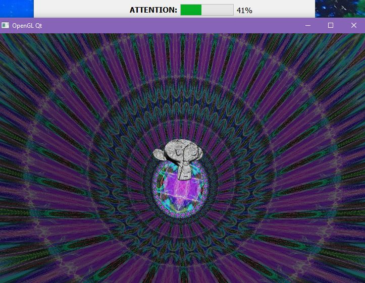
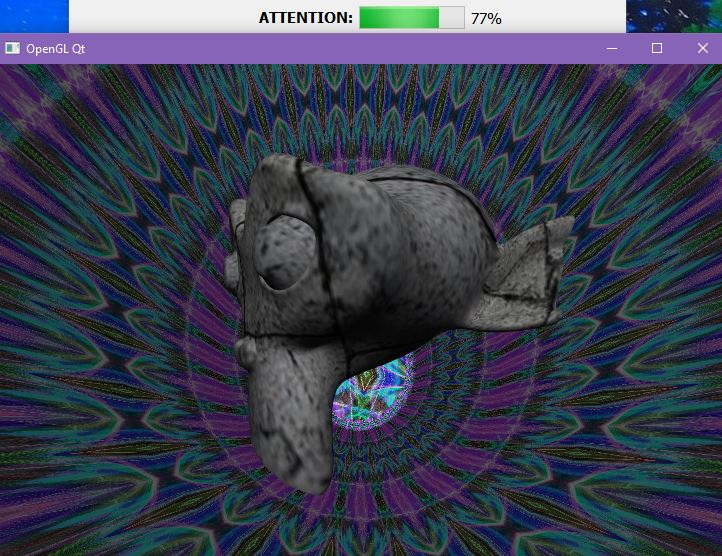

# opengl-qt

Simple example of OpenGL (GLU based) usage in Qt (5.15.2) based on MinGW compiler (8.1.0)

with an interaction based on mobile EEG device (MindWave Neurosky / MyndPlay):

attention level estimated from the device controls texture flow rotation and scale of object:

with a higher concentration - rotation is slower and object is bigger.

The project also allows to load and switch different .obj files and textures.

==== third-party code / libraries licenses: ====

OpenGL related functions based on code:

https://gitlab.com/SgAkErRu/labs/tree/master/2%20course/comp_graphics/graph_lab_4b

thinkgear.h / thinkgear.lib / thinkgear.dll from official MindWave NeuroSky SDK

https://store.neurosky.com/pages/license-agreement
